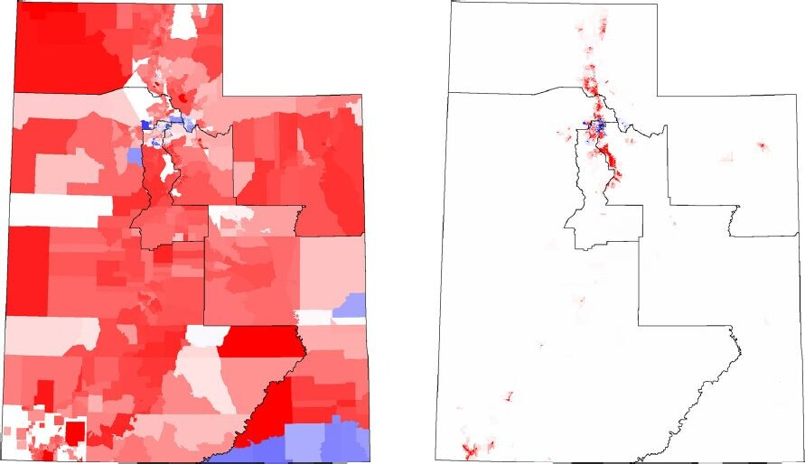

---

##### Download

+ [Paper](redistricting.pdf)
+ [Data](https://github.com/tylerjarvis/UtahRedistricting)
+ [Code](https://github.com/tylerjarvis/MathematicalElectionAnalysis)

---

##### Abstract

We discuss difficulties of evaluating partisan gerrymandering in the congressional districts in Utah and the failure of many common metrics in Utah. We explain why the Republican vote share in the least-Republican district (LRVS) is a good indicator of the advantage or disadvantage each party has in the Utah congressional districts. Although the LRVS only makes sense in settings with at most one competitive district, in that setting it directly captures the extent to which a given redistricting plan gives advantage or disadvantage to the Republican and Democratic parties. We use the LRVS to evaluate the most common measures of partisan gerrymandering in the context of Utah’s 2011 congressional districts. We do this by generating large ensembles of alternative redistricting plans using Markov chain Monte Carlo methods. We also discuss the implications of this new metric and our results on the question of whether the 2011 Utah congressional plan was gerrymandered.

---

##### Figure 1:


Two plots of the four Utah congressional districts, overlayed on representations of the political geography of the state. The typical plot (left panel) of Utah political geography, with each precinct colored by the percentage of Republican or Democratic voters, is misleading, because many of Utah’s precincts are very large and mostly uninhabited. The plot in the right panel is more accurate and informative; here the color indicates vote difference (number of Republican votes minus the number of Democratic votes) divided by the area of the precinct. This plot makes it easier to see how the partisan vote share is distributed across the state. The fact that most of the population resides in the narrow corridor of the Wasatch Front is also clearly visible.

---

##### Citation

Annika King, Jacob Murri, Jake Callahan, Adrienne Russell and Tyler J. Jarvis (2022) Mathematical Analysis of Redistricting in Utah, Statistics and Public Policy, 9:1, 136-148, DOI: 10.1080/2330443X.2022.2105770

```BibTeX
@article{doi:10.1080/2330443X.2022.2105770,
	author = {Annika King, Jacob Murri, Jake Callahan, Adrienne Russell and Tyler J. Jarvis},
	doi = {10.1080/2330443X.2022.2105770},
	eprint = {https://doi.org/10.1080/2330443X.2022.2105770},
	journal = {Statistics and Public Policy},
	number = {1},
	pages = {136-148},
	publisher = {Taylor & Francis},
	title = {Mathematical Analysis of Redistricting in Utah},
	url = {https://doi.org/10.1080/2330443X.2022.2105770},
	volume = {9},
	year = {2022},
	bdsk-url-1 = {https://doi.org/10.1080/2330443X.2022.2105770}}
```

---
